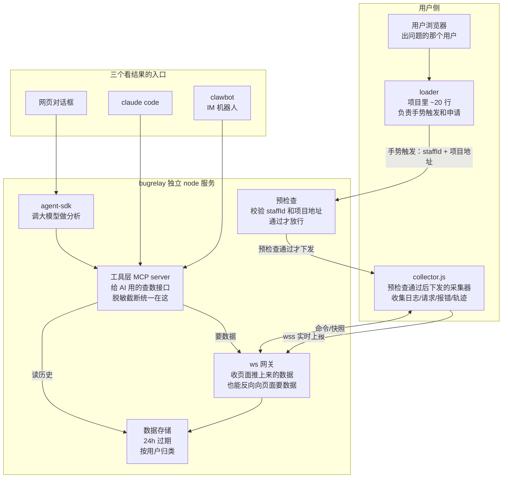
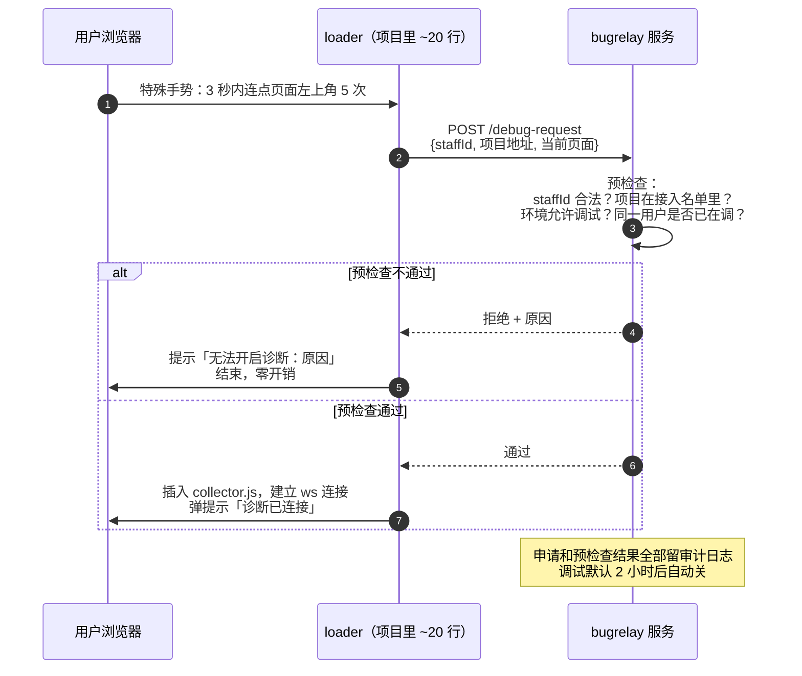
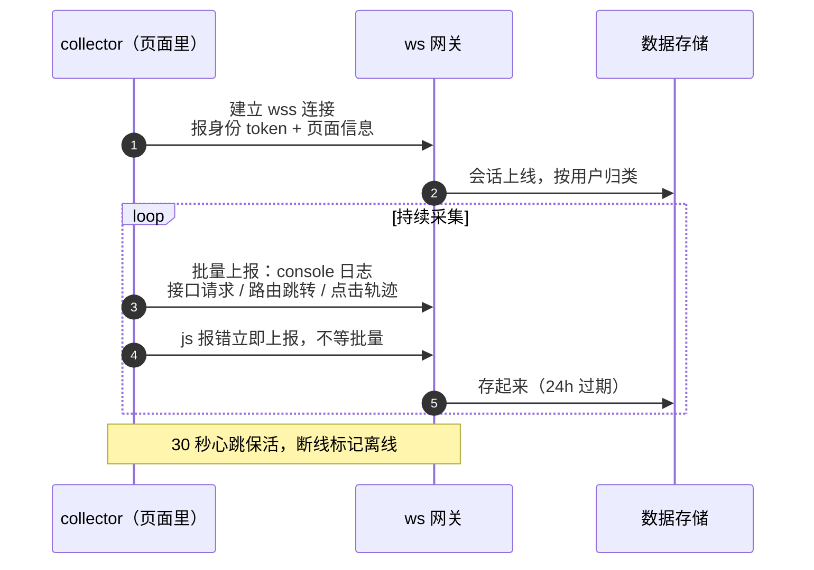
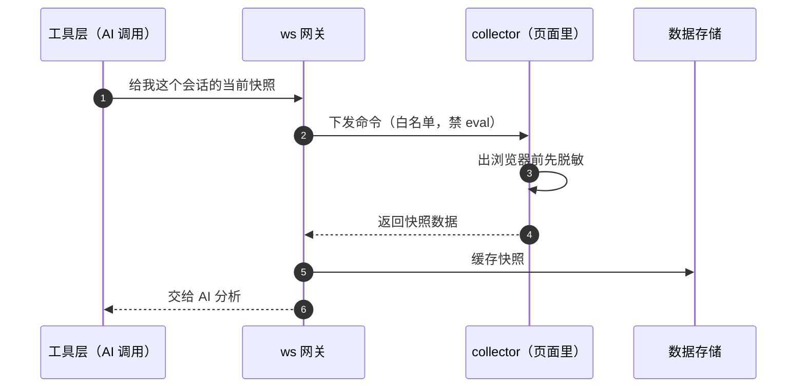
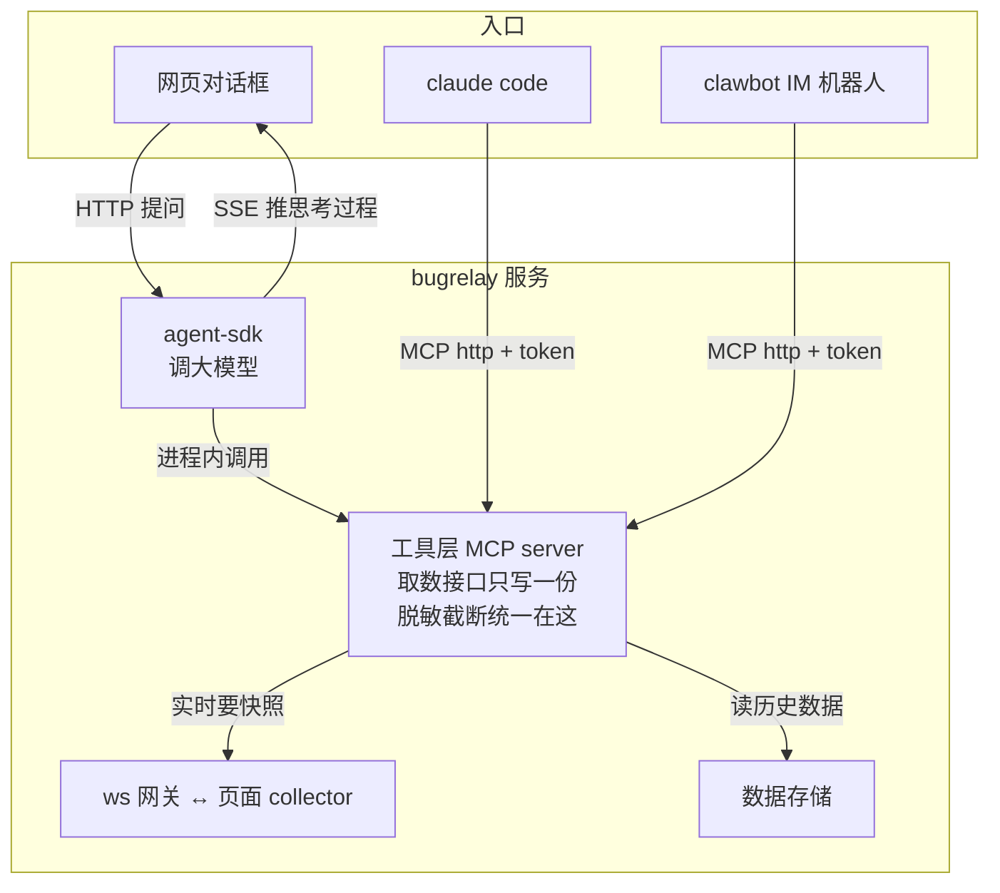
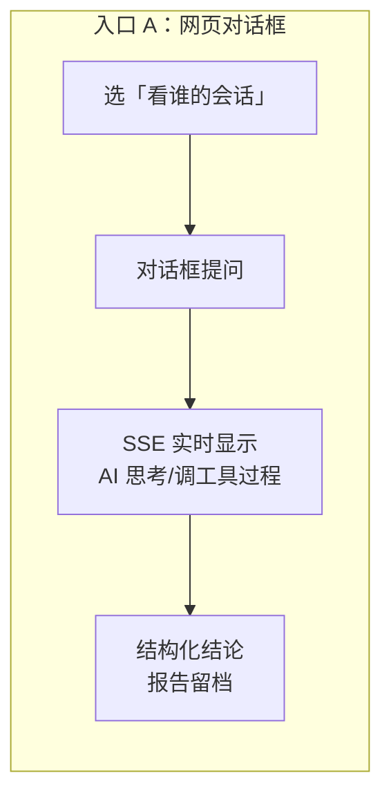
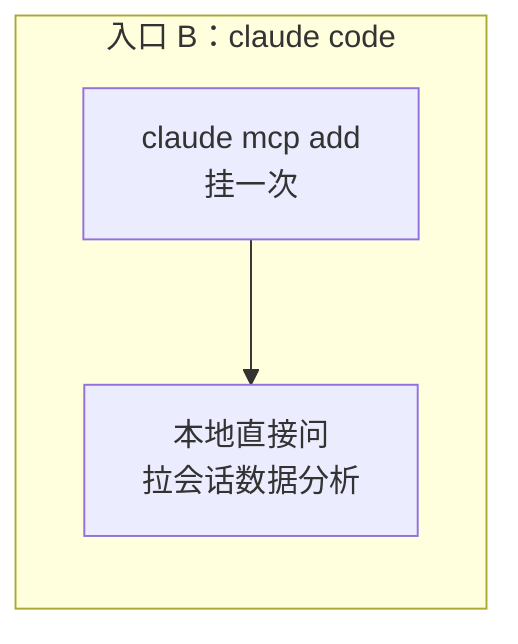

# bugrelay 独立服务方案

一句话：做一个独立的 node 服务。用户在页面上做个特殊手势（连点左上角 5 次），loader 把 staffId 和项目地址发给服务端；服务端预检查通过后下发采集 js 并建立 wss 连接，页面把报错、请求、操作记录实时上报；Claude 在服务端直接读这些数据分析问题。分析结果有三个入口能看：网页对话框、claude code、IM 机器人（clawbot）。

## 一、整体流程

### 0. 总览：一张图看全貌



核心链路：**用户做特殊手势 → loader 把 staffId + 项目地址发给服务端 → 服务端预检查 → 通过 → 下发 collector.js 并建立 ws 连接**。预检查不通过就什么都不发生，用户侧零开销。全程自动，无人工环节。

---

### 1. 开调试：手势发起 → 预检查 → 下发

蓝信内置应用 webview 没有地址栏，「URL 加参数」「发调试链接」全部不可用，所以入口只能是页面内的特殊手势。放不放行由服务端预检查自动裁决，无人工环节。



要点：

- **预检查自动裁决**：staffId、项目地址机器校验，通过即开，不等任何人
- **通过才发 js**：collector.js 不下发、ws 不建立，页面就完全没有采集行为
- **其他人零开销**：不做手势的用户，loader 不发任何请求，页面无任何额外加载

### 2. 采集：页面把数据实时推给服务（wss 长连接）

两个方向：**页面主动推**（持续上报）和**服务端主动拉**（分析时要快照）。

**上行：页面持续上报**



**下行：分析时服务端反向要数据**



### 3. 分析：三个入口，共用同一套取数工具

三个入口，共用同一套取数工具：



核心思路：**取数工具只写一份**，谁来看数据都走它，脱敏和截断也只在这一处做。这样三个入口看到的数据天然一致，不会这个入口脱敏了那个入口漏了。claude code 和 clawbot 不经过 agent-sdk，直接连 MCP 接口。

三个入口各长什么样：





```mermaid
flowchart LR
    subgraph C1[入口 C：clawbot]
        C2[群里 @ 机器人] --> C3{数据敏感级}
        C3 -->|概要| C4[直接答]
        C3 -->|详细数据| C5[@ 会话归属人<br/>回「同意」才放行]
        C3 -->|敏感数据| C6[不开放]
    end
```

## 二、模块说明

### 1. loader（写在项目里）+ collector（远程下发）

- **loader**：约 20 行，放在项目入口。就干两件事：监听特殊手势（连点左上角 5 次），触发后把 staffId + 项目地址发给服务端；预检查通过后插入 collector 的 script 标签。逻辑简单稳定，接入一次以后不用动
- **collector**：采集逻辑全在这个远程 js 里，由服务端下发。改采集逻辑只改服务端，业务项目不用发版。**采集代码绝不能写进项目**，否则改个 bug 要全项目发版
- 为什么不构建时打包进项目让全员生效？多人共用环境，全员采集代价太大，按人开关才是正解

### 2. collector.js（页面里的采集器，ES5 单文件）

从现有 tkt 版本搬过来，已经验证过：拦截 console / XHR / fetch（提取 errcode）、js 报错即时上报、路由追踪、点击轨迹（不采集输入框的值）、Vue2/Vue3 状态读取、响应服务端命令、发送前脱敏、ring buffer 批量发送。

### 3. ws 网关

协议沿用 tkt 已有的：hello（建连报身份）/ event（上报数据）/ result（命令返回）/ command（服务端下发命令）/ ping-pong（30 秒心跳）。命令走白名单，禁止 eval；断线标记离线。

### 4. 会话和数据存储

起步用单实例内存存储（带容量上限和空闲清理，tkt 有现成实现），数据 24 小时过期。以后要扩多实例再上 Redis。

**多用户多项目怎么区分：会话标识三元组**

```
sessionId = {projectId, staffId, pageId}
```

- **projectId**：手势申请时 loader 带项目地址，预检查映射成接入名单里的项目 id
- **staffId**：SSO 解析出的人，同一项目多人同调按人分开
- **pageId**：collector 建连生成的页面实例 id，同人开多标签页也不串

每一环都带这个标识：预检查返回的会话票据 ticket 已绑定 projectId + staffId；ws hello 带 ticket，校验后归属 sessionId；存储 key = sessionId，查询按项目/人过滤；AI 工具先 `list_sessions` 选人，后续调用都带 sessionId。100 个用户 5 个项目同时在线互不干扰。

### 5. 开调试的触发与预检查（重点）

> 场景限制：**蓝信内置应用的 webview 没有地址栏**，所以「URL 加参数」「发调试链接」这类方案全部不可用。入口只能是页面内的特殊手势，放行与否由服务端预检查自动裁决。

流程就是第一节那张图，拆开说两层：

**第一层 · 手势发起（用户侧）**

- 3 秒内连点页面左上角 5 次（手势逻辑内置在 loader，项目零成本接入）
- loader 收集 staffId（SSO 身份透传）+ 项目地址 + 当前页面，POST 给服务端
- 不做手势的用户：loader 不发任何请求，页面零额外开销

**第二层 · 预检查（服务端机器校验，通过即开）**

- staffId 是否合法、是否本人（SSO 校验）
- 项目地址是否在接入名单里
- 当前环境是否允许调试（生产/类生产默认拒）
- 同一用户是否已有进行中的调试会话
- 通过：立即下发 collector.js、建立 ws；不通过：拒绝并返回原因
- 调试默认 2 小时自动关；申请和预检查结果全部留审计日志

**会话和对话按用户绑定**（v1 按 token，v2 升级 staffId）：collector 建连时带身份凭证，会话归属到具体的人。分析时（网页/机器人）先选「看谁的会话」再提问，分析报告挂在归属人下留档。同项目多人同时调试互不串。

**身份（v1 简化决策）**：各项目 token 结构、存储位置各不相同（localStorage / cookie / vuex，`x-access-token` 等各种头），loader 不做解析。v1 做法：**从项目自己发的请求里抄认证头**——collector 本来就 hook 了 XHR/fetch，发现请求带 `x-access-token` 这类头就记下来，手势申请时原样带给服务端。服务端不解 token、不调 SSO，直接当身份凭证存，v1 会话先按 token 归属，跑通主流程即可。

后置（v2 再做，结构差异在服务端消化，loader 永远不解 storage）：

1. **服务端解析**：拿凭证调统一登录校验接口换 staffId，会话归属从 token 升级到 staffId，防伪造
2. **接入名单配取值规则**：没认证头可抄的项目，名单登记 `{ staffIdFrom: "localStorage:userInfo.staffId" }` 这类规则，结构变了改配置不发版
3. **手填工号**：都取不到的最后兜底，服务端校验工号合法性

### 6. 工具层（MCP server，只写一份）

就是一组「查数据」的接口，给 AI 调用：

| 工具 | 作用 |
|---|---|
| `list_sessions` | 列会话（可按用户过滤） |
| `get_snapshot` | 通过 ws 实时向页面要快照（请求/日志/报错/Vuex/轨迹） |
| `get_requests` / `get_errors` / `get_console` | 分类拉取，支持过滤 |
| `get_vue_state` / `get_vuex_trace` | 查 Vue 状态和 mutation 链 |
| `get_breadcrumbs` / `get_dom` | 查操作轨迹 / DOM 片段 |

### 7. 网页对话框（入口 A）

- 服务端用 `@anthropic-ai/claude-agent-sdk` 调大模型；如果公司 gateway 兼容 Anthropic 协议，把 `ANTHROPIC_BASE_URL` 指过去就行，否则用独立 API key
- 工具层进程内挂载（`createSdkMcpServer`），输出结构化结论，权限模式 `dontAsk`
- 支持多轮追问：每个会话一个 query 实例
- 通过 SSE 把「正在思考什么、调了哪个工具」实时推到页面，避免用户以为卡死
- 防滥用：排队 + 每会话限次 + 记录用量

### 8. MCP http 接口（入口 B / C）

- streamable http transport + token 鉴权
- claude code：`claude mcp add` 挂上就能用
- clawbot：机器人挂同一个接口，群里 @ 一下就出分析结论，测试不用离开聊天窗口

**clawbot 必须分级审批**（群里任何人都能 @，不能不设防）：

| 级别 | 工具 | 审批要求 |
|---|---|---|
| L1 只读概要 | list_sessions、get_errors（摘要） | 免审批 |
| L2 详细数据 | get_snapshot / get_console / get_requests（已脱敏） | 会话归属人确认：bot @ 该用户，回「同意」才放行；本人查自己的不用确认 |
| L3 敏感数据 | get_dom / get_storage | 不对 clawbot 开放（只有 claude code 通道 + 管理员能用） |

- bot 绑定项目白名单 + 群白名单，非授权群不回答
- 全量审计：谁问的、查的谁的数据、用的哪个工具、什么时间

### 9. 分析页

会话列表（按人过滤）/ 对话框 / 原始数据面板（人工核对用）/ 报告留档。

## 三、安全红线 ⛔

- 服务必须上 https（wss 和 script 注入的前提）
- 三层鉴权：collector 建连要 token / MCP 接口要 token / 分析页要登录
- 脱敏做两道：collector 发出前脱敏 + 工具层二次截断
- 服务端下发命令走白名单、禁 eval，永不放开
- 业务项目配了 CSP 的话，服务域名要加进白名单（写进接入 checklist）
- 开调试申请、MCP 连接全部留审计日志

## 四、哪些搬现成的，哪些要新写

| 从 tkt 平移（已验证） | 新写 |
|---|---|
| ws 协议 + 网关 | loader + 手势触发/预检查 |
| collector.js 全套 | 会话持久化 + 过期清理 + 用户身份 |
| agent-sdk + 进程内 MCP 分析链 | 对话页面 + 多轮 |
| SSE 步骤流 | MCP http 接口 + 鉴权 |
| 结构化结论 + 报告 | 分析页 |

## 五、实现步骤（两步走）

### 第一步：node 采集链路（先能拿到数据，不接 AI）

目标：用户手势触发后，数据能从页面流到服务端，人能在面板上看到。

1. **服务骨架**：node 服务起起来，https + wss
2. **预检查接口**：`POST /debug-request`，校验 staffId + 项目地址 + 环境，通过返回 collector 地址和 ws 票据
3. **ws 网关**：hello / event / result / command / ping-pong 协议，会话按 staffId 归类（tkt 平移）
4. **collector 托管**：collector.js 挂在服务域名下，可远程下发、集中升级（tkt 平移）
5. **loader 交付**：20 行手势 + 申请 + 插 script 代码，给业务项目接入
6. **数据存储 + 面板**：内存存储 24h 过期；简单页面列会话、看原始数据（请求/日志/报错/轨迹），人工核对用

验收：手势触发 → 预检查通过 → 页面提示「诊断已连接」→ 面板实时看到该用户的请求和报错。

### 第二步：AI 接入（数据之上加分析）

目标：Claude 直接读采集数据出结论，三个入口可用。

1. **工具层 MCP server**：list_sessions / get_snapshot / get_requests / get_errors / get_vue_state 等，脱敏截断统一在这层
2. **网页对话框**：agent-sdk 进程内挂工具，SSE 推思考过程，多轮追问，报告留档
3. **MCP http 接口**：token 鉴权，claude code `claude mcp add` 即用，clawbot 挂同一接口
4. **加固**：限流 / 每会话限次 / 用量记录 / CSP 接入 checklist

验收：网页对话框选一个会话提问「这个用户为什么白屏」，AI 自动调工具拉数据给出结论；claude code 和 clawbot 同样能问。

## 六、待拍板的问题

1. 公司 gateway 能不能直接用：`curl $BASE_URL/v1/messages` 通了就用 agent-sdk 直连；不通就申请独立 API key
2. ~~统一登录校验接口~~（v1 已跳过：直接抄项目请求里的认证头当凭证，SSO 换 staffId 留到 v2）
3. 部署形态：每个项目独立部署（同源免跨域），还是集中部署一套（要处理跨域 + 项目标识）
4. clawbot 怎么接：机器人直连 MCP 接口，还是走 bot 平台中转
